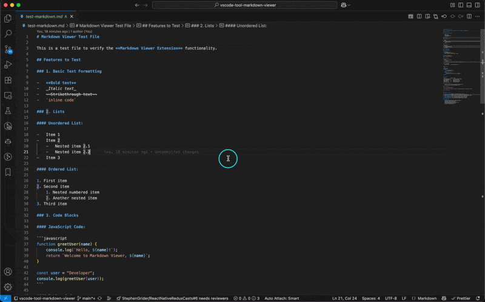

# Markdown Viewer

A powerful VSCode extension that provides enhanced markdown viewing and editing capabilities with syntax highlighting and live preview.

## 🌟 Features

-   **Preview Mode (Default)**: Opens markdown files in a beautiful rendered preview
-   **Edit Mode**: Full-featured markdown editor with live preview
-   **Syntax Highlighting**: Code blocks with proper syntax highlighting using highlight.js
-   **Toggle Mode**: Easy switching between preview and edit modes
-   **Modern UI**: Clean, VSCode-themed interface with dark/light mode support
-   **Live Updates**: Real-time preview updates as you type
-   **Custom Editor**: Seamlessly integrates as the default markdown editor

## 📹 Demo

## 🚀 Getting Started

1. Install the extension
2. Open any `.md` file - it will automatically open in preview mode
3. Use the toolbar buttons to:
    - **Preview button**: Open pure preview mode
    - **Toggle button**: Switch between preview-only and edit+preview modes

## 🎯 Commands

-   `Markdown Viewer: Open Preview` - Open file in preview mode
-   `Markdown Viewer: Toggle Preview/Edit Mode` - Switch between modes

## 🔧 Features in Detail

### Syntax Highlighting

Supports syntax highlighting for:

-   JavaScript/TypeScript
-   Python
-   JSON
-   HTML/CSS
-   And many more languages via highlight.js

### Responsive Design

-   Dark/Light theme compatibility
-   Proper table styling with borders and hover effects
-   Code blocks with padding and shadows
-   Clean typography optimized for reading

### Editing Experience

-   Split-screen edit and preview
-   Live updates as you type
-   Debounced saving for performance
-   Full markdown syntax support

## 📋 Requirements

-   VSCode 1.74.0 or higher
-   No additional dependencies required

## ⚙️ Configuration

The extension works out of the box with no configuration needed. It automatically:

-   Sets itself as the default editor for `.md` files
-   Opens markdown files in preview mode
-   Provides toolbar buttons for mode switching

## 🐛 Known Issues

Please report issues on our [GitHub repository](https://github.com/ArtixZ/vscode-extension-markdown-viewer/issues).

## 📝 Release Notes

### 0.0.1

Initial release featuring:

-   Preview mode for markdown files
-   Edit mode with live preview
-   Syntax highlighting support
-   Toggle functionality between modes
-   Modern UI design with theme support
-   Default markdown editor integration

## 🤝 Contributing

Contributions are welcome! Please feel free to submit a Pull Request on [GitHub](https://github.com/ArtixZ/vscode-extension-markdown-viewer).

## 📄 License

This extension is licensed under the [MIT License](LICENSE).

---

**Enjoy enhanced markdown editing and previewing!** 🎉
